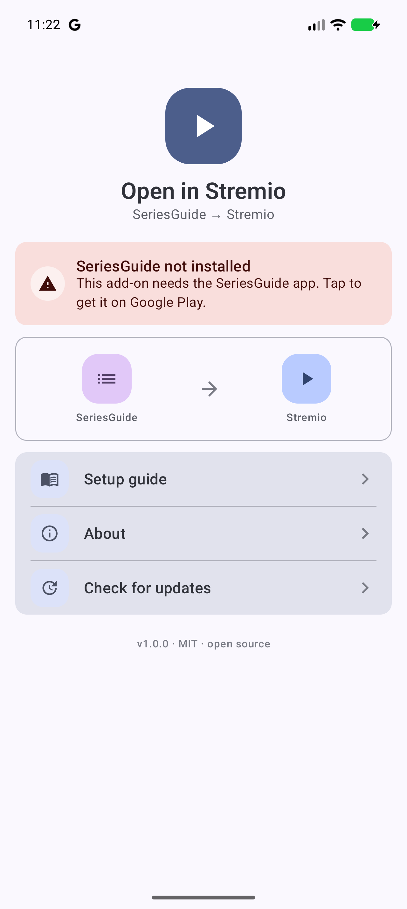
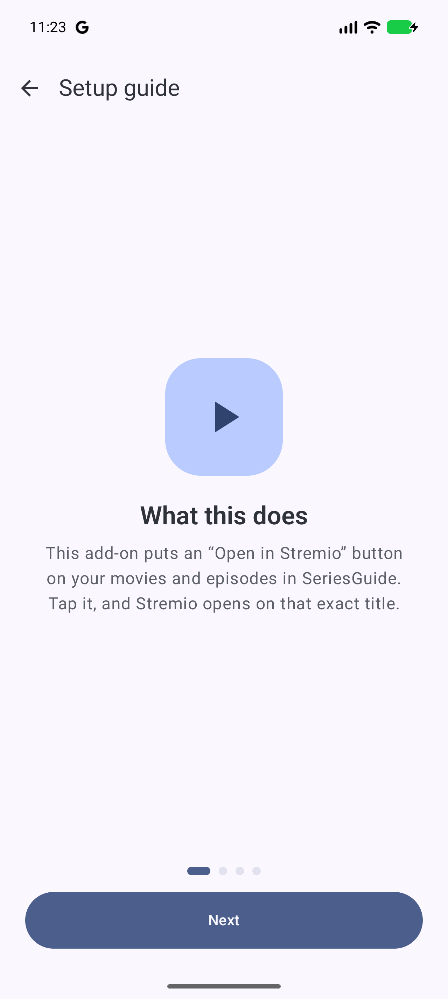
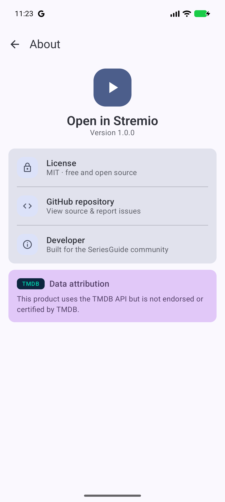
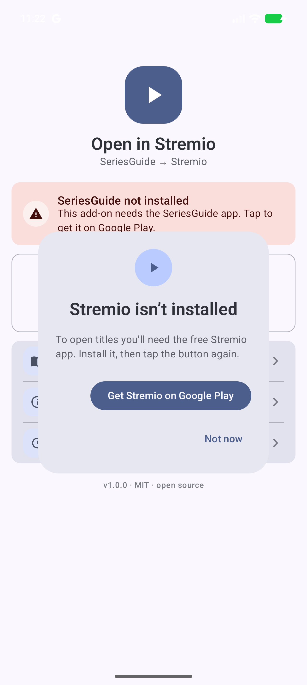

# Open in Stremio — SeriesGuide extension

An open-source Android extension for [SeriesGuide](https://seriesguide.battlelancer.com/) that adds an **"Open in Stremio"** button under every movie and TV episode. Tap it, and [Stremio](https://www.stremio.com/) opens directly on that exact title — no searching, no typing.

Works on Android phones and on Android TV (including the NVIDIA Shield).

| Home | Setup guide | About | If Stremio is missing |
|---|---|---|---|
|  |  |  |  |

## What you need

- The **SeriesGuide** app ([Google Play](https://play.google.com/store/apps/details?id=com.battlelancer.seriesguide))
- The **Stremio** app ([Google Play](https://play.google.com/store/apps/details?id=com.stremio.one))
- Android 6.0 or newer

## Install on a phone

1. Download the latest APK from the [Releases page](https://github.com/MRXGAMER999/open-in-stremio/releases).
2. Open the downloaded file. If your phone asks, allow installing from this source.
3. Open the **Open in Stremio** app once — a short setup guide walks you through the rest.
4. The important step: open **SeriesGuide → Settings → Extensions**, add **"Open in Stremio"**, and you're done. The button now appears under every movie and episode in SeriesGuide.

> The button lives **inside SeriesGuide** — not in this app, and not in Stremio. This app is just a setup helper.

## Install on an NVIDIA Shield / Android TV

The extension works the same on TV, but there is **no app icon on the TV home screen** — that's by design, since everything happens inside SeriesGuide. To install, sideload the APK using one of:

- **Downloader app** (from the Play Store on the TV): enter the direct APK link from the Releases page.
- **Send Files to TV**: push the APK from your phone to the TV.
- **adb over the network**: `adb connect <shield-ip>:5555` then `adb install open-in-stremio.apk`.

You may need to enable installing unknown apps in the TV's settings. After installing, enable the extension inside SeriesGuide exactly like on the phone (SeriesGuide → Settings → Extensions). You can reach this app's own screen from the extension's settings entry there.

## How it works

- SeriesGuide tells the extension which movie or episode you're looking at.
- The extension figures out the title's IMDb id: usually SeriesGuide already provides it; otherwise it asks [TMDb](https://www.themoviedb.org/) once and remembers the answer forever.
- Tapping the button opens a Stremio deep link:
  - Movies: `stremio:///detail/movie/<imdbId>/<imdbId>`
  - Episodes: `stremio:///detail/series/<showImdbId>/<showImdbId>:<season>:<episode>`
- If a title has no IMDb id anywhere (rare — very new or obscure titles), the button becomes **"Search in Stremio"** instead of leading nowhere.
- If Stremio isn't installed, you get a friendly dialog with a Play Store link — nothing crashes, nothing fails silently.
- On Android TV the link asks Stremio to auto-play (`autoPlay=true`). Stremio only honors this when you've already picked a stream for that title before; otherwise it lands on the title's detail page, ready to play — same as on the phone.

## Building from source

1. Open the project in Android Studio (or run `gradlew assembleDebug`).
2. Optional: for the TMDb fallback lookups, copy `local.properties.example` over your `local.properties` values and set `TMDB_API_KEY` (free key from [TMDb settings](https://www.themoviedb.org/settings/api)). Building **without** a key works fine — titles that SeriesGuide has no IMDb id for then get the "Search in Stremio" button.
3. Release builds are intentionally not minified; see `app/proguard-rules.pro` for why.

## Privacy

No analytics, no tracking, no accounts. The app talks to exactly two services, and only when needed: TMDb (to look up an IMDb id when SeriesGuide doesn't provide one) and the GitHub API (only when you tap "Check for updates" — nothing downloads or installs automatically).

## Attribution & trademarks

This product uses the TMDB API but is not endorsed or certified by TMDB.

SeriesGuide is a project by Uwe Trottmann. Stremio is a trademark of its respective owners. This project is an independent, unofficial companion and is not affiliated with or endorsed by SeriesGuide or Stremio.

## License

[MIT](LICENSE)
